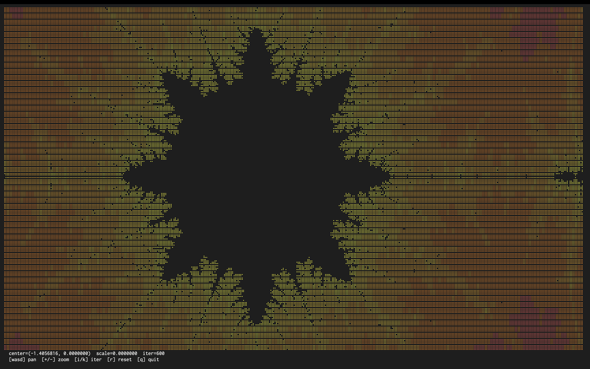

# Mandelbrot in x86-64 Assembly

A small collection of Mandelbrot set renderers written in pure x86-64 Linux assembly. No libc, no dependencies — just NASM, `ld`, and raw kernel syscalls. Each binary is under 15 KB.

The collection builds up from a "Hello, World!" syscall to an interactive, color, Braille-resolution, terminal-size-aware fractal explorer.



## Files

| File | What it does |
|------|--------------|
| `hello.asm` | Classic "Hello, World!" via `write` and `exit` syscalls. The reference for "lowest level program that runs." |
| `mandel.asm` | ASCII Mandelbrot, 80×30, using the x87 FPU. Renders once and exits. |
| `mandel_braille.asm` | Color Braille Mandelbrot, 80×40 character cells (= 160×160 subpixels). Uses SSE2 doubles. Renders once and exits. |
| `mandel_zoom.asm` | Interactive Braille explorer. Pan, zoom, adjust iterations. Auto-fits the terminal and reflows on resize. |

## Requirements

- A Linux x86-64 system (or WSL2 on Windows, or a Linux VM/container on macOS)
- `nasm` (the assembler)
- `binutils` (provides `ld`)

```bash
sudo apt install nasm binutils      # Debian / Ubuntu
sudo dnf install nasm binutils      # Fedora
sudo pacman -S nasm binutils        # Arch
```

For the Braille renderers you also want a terminal with:
- A monospace font that includes Unicode Braille glyphs (U+2800–U+28FF). Most modern programming fonts have these: **DejaVu Sans Mono**, **JetBrains Mono**, **Cascadia Code**, **Iosevka**, **Fira Code**, **Source Code Pro**.
- 256-color support. Standard in iTerm2, Alacritty, kitty, WezTerm, gnome-terminal, Konsole, Windows Terminal, and most others.

## Build & run

Each program is a single `.asm` file. Same recipe for all of them:

```bash
nasm -f elf64 <name>.asm -o <name>.o
ld <name>.o -o <name>
./<name>
```

For example:

```bash
nasm -f elf64 mandel_zoom.asm -o mandel_zoom.o
ld mandel_zoom.o -o mandel_zoom
./mandel_zoom
```

## Programs

### `hello.asm` — Hello, World

Reference point. Writes the string to stdout via syscall 1 (`write`), then exits via syscall 60 (`exit`). The resulting binary is about 1 KB.

### `mandel.asm` — ASCII Mandelbrot

Renders an 80×30 Mandelbrot to stdout once, then exits. Uses the x87 FPU stack for floating-point math (`fld`, `fmul`, `fadd`, `fcomp`, `fxch`). Each cell maps to one character from the palette `" .,:;i1tfLCG08@"` based on how quickly that point escapes.

### `mandel_braille.asm` — Colored Braille Mandelbrot

Same idea but better. Each character cell is divided into a 2×4 grid of subpixels, encoded into a Unicode Braille character (each glyph has 8 individually settable dots). For an 80×40 character grid that's 160×160 effective pixels.

For each cell, the program iterates 8 subpixels, then:
- Sets one bit in the Braille byte per escaped subpixel
- Averages the iteration counts and maps to a 16-step ANSI 256-color palette (deep blue → purple → red → orange → yellow)
- Emits `\033[38;5;Nm` followed by the UTF-8 encoding of `U+2800 + bits`

The math is done in SSE2 (`mulsd`, `addsd`, `ucomisd`) using normal `xmm` registers, which is far cleaner than the x87 stack.

### `mandel_zoom.asm` — Interactive Explorer

Everything from the Braille version, plus:

**Controls**
- `w` `a` `s` `d` — pan up / left / down / right (15% of current view per press)
- `+` or `=` — zoom in (0.7×, auto-bumps the iteration cap)
- `-` or `_` — zoom out (1.43×)
- `i` / `k` — manually decrease / increase max iterations
- `r` — reset to the original view
- `q` or `ESC` — quit

**Status display** (bottom two lines):
```
  center=(-0.7000000, 0.0000000)  scale=1.5000000  iter=100
  [wasd] pan  [+/-] zoom  [i/k] iter  [r] reset  [q] quit
```

**Terminal-size aware.** At startup the program calls `ioctl(stdout, TIOCGWINSZ, ...)` to read the current window dimensions and renders to fill them (minus the two status rows). On `SIGWINCH` it re-queries and re-renders, so dragging the terminal to a new size just works.

**Interesting coordinates to visit**
- Seahorse Valley: pan to around `(-0.745, 0.1)` and zoom in
- Elephant Valley: `(0.275, 0.0)`
- Mini-Mandelbrot: `(-1.768, 0.0)`

## How it works (the short version)

The Mandelbrot set is the set of complex numbers `c` for which the sequence `z_{n+1} = z_n² + c` (starting from `z_0 = 0`) stays bounded. In practice that means: pick a max iteration count, iterate the formula, and if `|z|² > 4` at any point, the sequence is provably going to infinity (escape). The number of iterations before escape gives the color.

The Braille version does this for 8 subpixels per character cell, packs the results into one Unicode glyph, and prepends an ANSI color escape.

The interactive version puts the terminal in **raw mode** (no echo, no line buffering) by calling `ioctl(TCSETS)` to clear the `ICANON` and `ECHO` flags. That lets it read single keypresses without waiting for Enter. On exit (whether through `q`, `ESC`, Ctrl-C, or `SIGTERM`) a signal handler restores the original termios, makes the cursor visible again, and resets terminal colors.

Each frame writes `\033[H` (cursor home) and overwrites in place instead of clearing — clearing causes visible flicker. Each line ends with `\033[K` (erase to end of line) so leftover characters from a previous, wider line don't bleed through.

## Limitations

**Double precision floats** give about 15 digits of precision, so you can zoom to roughly 10^13× before adjacent pixels start mapping to the same complex number and the image goes pixelated. Going deeper than that requires either x87 80-bit extended precision (modest improvement) or arbitrary-precision arithmetic (a much bigger project).

**Single-threaded.** Render time scales linearly with iteration cap and pixel count. On a modern machine the default 80×40 view renders in milliseconds; a 200×60 view at 500 iterations might take a noticeable fraction of a second per frame. Multi-core rendering with `clone()` would be a natural next step.

**Linux-only.** The code uses Linux syscall numbers (1 for write, 16 for ioctl, etc.) and Linux-specific termios layout. Porting to macOS would mean different syscall numbers and Mach-O instead of ELF; to Windows, an entirely different ABI calling `kernel32.dll`. Should run fine under WSL2 on Windows.

## Why assembly?

No reason other than it's fun. The same algorithm in C is shorter and faster (the compiler will autovectorize the inner loop into SIMD), and in something like Python with NumPy it's even shorter. But assembling raw bytes that the CPU runs directly, with the only abstraction being NASM's syntax over machine code, is a nice exercise in understanding what's actually happening underneath.

A few things you get to see clearly that higher-level languages hide:
- The x87 FPU is a stack machine, not a register file. SSE2 has actual named registers.
- A "system call" really is just `mov` arguments into specific registers and execute `syscall`. The kernel takes it from there.
- "Raw mode" terminals are just a small struct (`termios`) you can read and modify with ioctl.
- ANSI escape sequences aren't magic — they're literally bytes the terminal interprets specially.

## License

Public domain / CC0. Do whatever you want with it.
